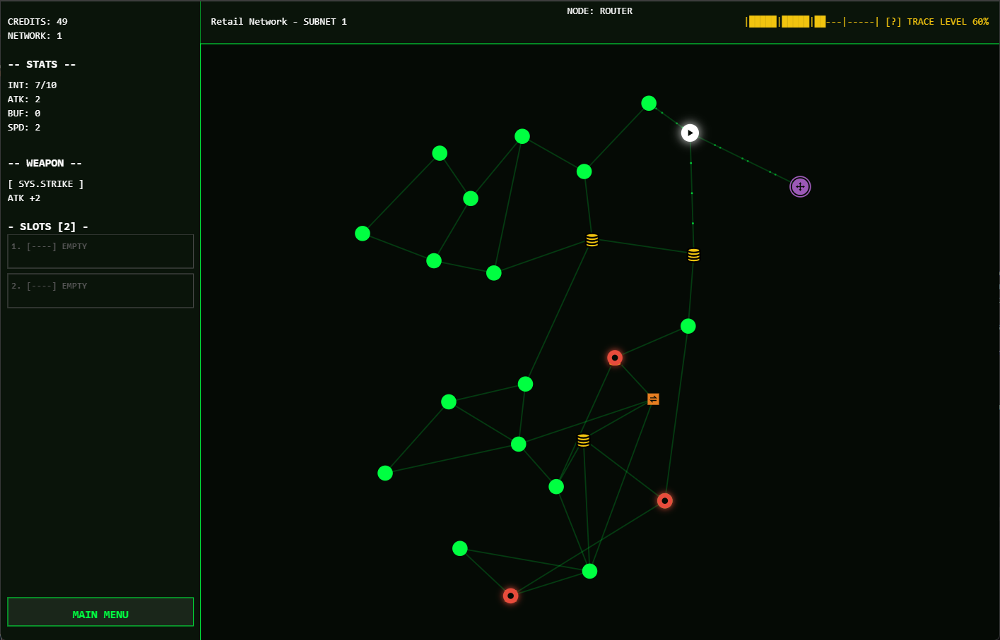
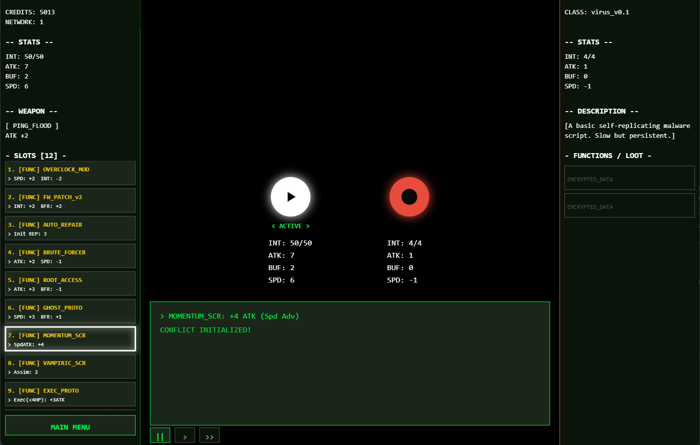
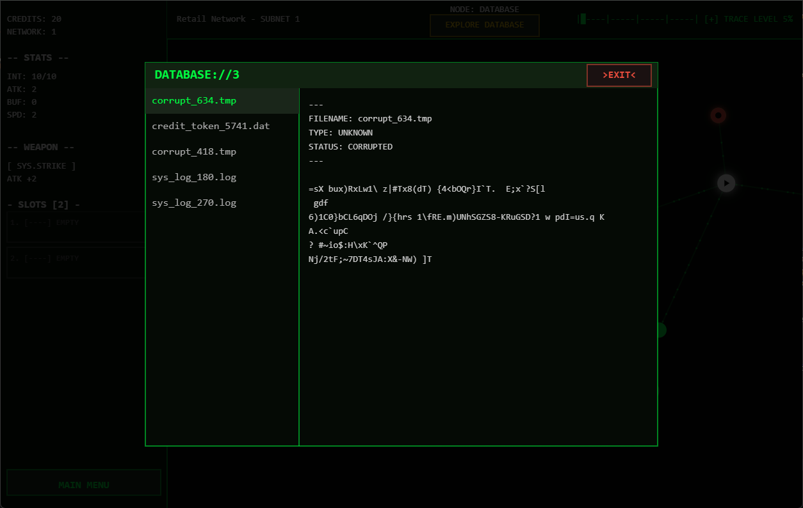

# TRACE

## About

`TRACE` is a browser-based roguelike autobattler. Navigate through compromised digital networks, scavenge databases for new programs, manage your memory slots, and outrun rogue system entities using automated, stat-driven combat.

* **Current Version:** `v0.0.1-experimental` 
* **Status:** `Experimental` - This game is in early development. Mechanics, features, and balancing can and will change.
* **Play now!:** [via GitHub Pages](https://daniel-meek.github.io/TRACE)

## Screenshots

<div align="center">
  
  <br>
  
  <br>
  
</div>

## Gameplay Features

* **Network Exploration:** Traverse procedurally generated subnets. Discover Routers, Switches, Databases, Dark Net Access Nodes, and Gateways to dive deeper into the network.
* **Automated Combat:** Engage viruses and outrun System Hunters in turn-based, automated combat. Your speed determines the turn order, and equipped functions trigger automatically during the attack cycle.
* **Memory Management:** Drag and drop Functions and Utilities into limited memory slots. Expand your slots over time and manage a balance between passive buffs and active utility.
* **Data Loadouts:** Start runs using predefined system loadouts, altering your base health, speed, initial weapon, and starting credits.
* **Functions & Utilities:** Equip **Functions** (e.g., *Momentum_Script*, *Firewall_Patch*) to passively alter your combat stats and trigger special abilities during battles. Execute **Utilities** (e.g., *File_Repair*, *Ping_Sweep*) outside of combat to restore integrity or reveal hidden network nodes.
* **Trace Levels:** Every move increases your system tracability. Reach maximum trace, and aggressive System Hunters will spawn and pursue you across the network.

## Local Setup

Since `TRACE` is built entirely with standard HTML5, CSS3, and JavaScript (Canvas API), no build steps or dependencies are required to run it locally.

1. **Clone the repository:**
   ```bash
   git clone https://github.com/daniel-meek/network-explorer.git
   cd network-explorer
   ```

2. **Run the game***
   Simply open the index.html file in any modern web browser.

## Changelog

### v0.0.1-experimental - Initial Release
- Initial commit and project structure.
- Implemented procedural node network generation and rendering.
- Added autobattler combat loop with dynamic speed-based logic and lifesteal/execution triggers.
- Introduced loadout selection system (Standard and Debug protocols).
- Split item architecture into persistent Functions and consumable Utilities.
- Implemented touch-compatible drag-and-drop inventory slot management and UI scrolling.
- Added visual trace mechanic and hostile pursuing entities.
- Established UI layouts for Shops, Terminals, and Loot Drop screens.

## Author
Developed with ☕ by @daniel-meek

## License
This project is licensed under the MIT License. See the [LICENSE](LICENSE) file for the full text.